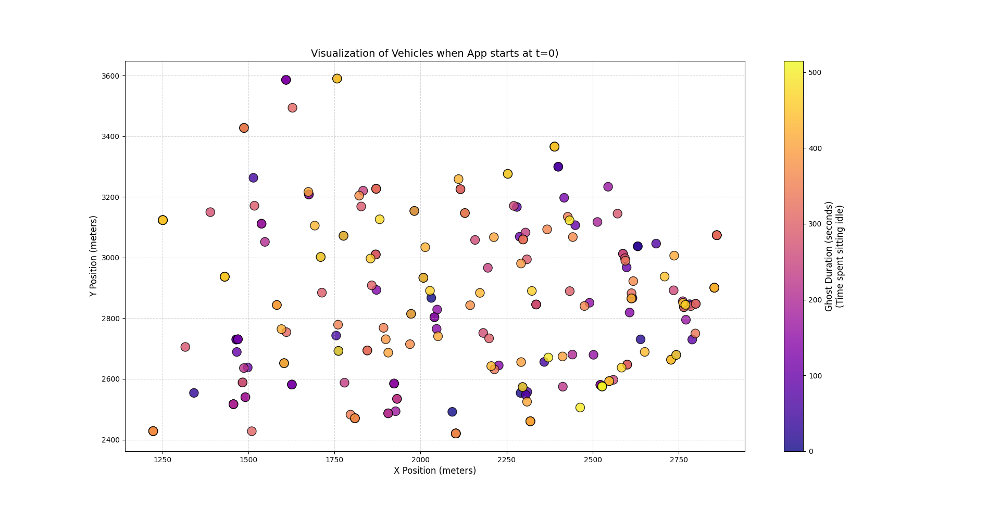

# VNDN Beaconing Simulation with Packet Drop Tracer

Here I simulated vehicle beaconing within a Vehicular Named Data Networking (VNDN) environment. The mobility data was generated using SUMO and converted into `.tcl` format for integration with the simulator.

## Overview

The core component is a custom `Vehicle` application. Each vehicle is configured to broadcast a beacon Interest packet every **1 second**. To evaluate the reliability of the network, we trace packet drops at the physical layer using two specific trace sources:

- **`PhyRxDrop`**: Indicates a packet was dropped during reception (e.g., due to collisions or weak signal).
- **`PhyTxDrop`**: Indicates a packet was dropped during a transmission attempt (e.g., the radio was busy or switching channels).

During initial testing, I observed a massive packet drop rate when setting the application start time to `0s` for all vehicles.

The issue arises because the application was active **before the vehicle actually entered the SUMO simulation**. Since many vehicles share the same entry points, their initial coordinates were positioned very close to each other. This caused the waiting vehicles to form dense clusters that broadcasted continuously.


As a result, it created a "jammer" effect at the entry coordinates, causing massive interference and collisions for any active vehicles passing nearby.

## The Solution: NS2 Node Utility

To resolve this, I implemented the `Ns2NodeUtility`.

This utility parses the `ns2mobility.tcl` file to extract the precise **entry** and **exit** timestamps for every vehicle. Instead of starting all applications at `0s`, I use this data to synchronize the application life-cycle with the mobility trace.

By ensuring vehicles only transmit when they physically exist on the road, I eliminated the artificial interference caused by the ghost nodes.

## **Usage**

### **Installation**

1. Install ndnSIM: https://ndnsim.net/current/
2. Clone this repository into your `ns-3/scratch` directory.

---

## **Compilation**

Run the simulation:

```bash
./waf --run vanet-beacon
```
